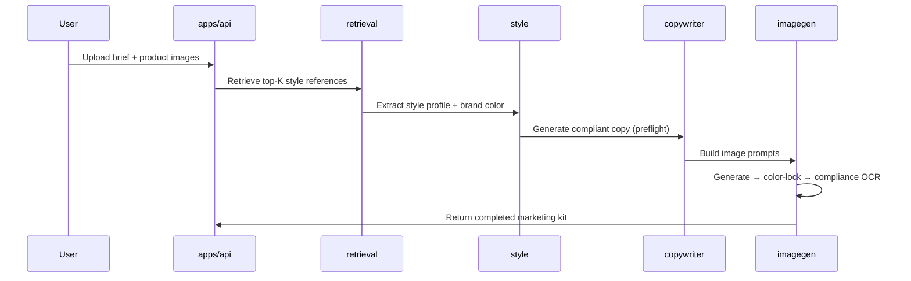

# AIShop Studio

AIShop Studio is a single-tenant, self-hosted platform for generating complete marketing kits
(hero images, detail shots, copy, and compliance checks) from a product brief. It is designed
for a single operator account (`aishop_local`) and runs entirely on your own infrastructure —
no vendor lock-in, swappable AI providers via a unified config file.

---

## Architecture

```
aishop-img-studio/
├── apps/
│   ├── web/          # Next.js storefront + editor UI
│   ├── marketing/    # Next.js marketing / landing pages
│   └── api/          # FastAPI async backend
├── services/
│   ├── providers/    # Vendor abstraction layer (OpenAI, Anthropic, etc.)
│   ├── retrieval/    # Milvus vector search — top-K reference retrieval
│   ├── style/        # Style extraction + brand-consistency scoring
│   ├── copywriter/   # LLM copy generation (headline, body, CTA)
│   ├── imagegen/     # Image generation orchestration + color lock
│   └── editor/       # Non-destructive image editing pipeline
├── packages/
│   └── schemas/      # Shared Zod + Pydantic schema definitions
└── infra/
    ├── docker-compose.yml   # Postgres, MinIO, Milvus, Redis
    └── migrations/          # SQL migration files
```

---

## Kit-Generation Flow



---

## Bootstrap

```bash
# 1. Install all dependencies
make bootstrap

# 2. Configure environment
cp .env.example .env
# edit .env — set DATABASE_URL, MINIO_*, etc.

# 3. Start infrastructure (Postgres, MinIO, Milvus, Redis)
make compose-up

# 4. Run database migrations
make migrate

# 5. Create the local operator user
make seed-user
# or: make seed-user PASSWORD=mysecret

# 6. (Optional) Load the sample kit fixture
make seed-sample-kit

# 7. Start development servers
make dev
```

---

## Make Targets

| Target             | Description                                                                 |
|--------------------|-----------------------------------------------------------------------------|
| `bootstrap`        | Install pnpm + uv dependencies and pre-commit hooks                         |
| `compose-up`       | Start full infra stack (Postgres, MinIO, Milvus, Redis) in detached mode    |
| `compose-down`     | Stop and remove infra containers                                            |
| `compose-logs`     | Tail logs from all infra containers                                         |
| `dev`              | Run Next.js apps + FastAPI in parallel (hot-reload)                         |
| `test`             | Run all JS/TS and Python tests                                              |
| `lint`             | Run Biome (JS/TS) and Ruff (Python) linters                                 |
| `typecheck`        | Run TypeScript and mypy type checks                                         |
| `migrate`          | Apply database migrations via `scripts/migrate.py`                          |
| `seed-user`        | Create the `aishop_local` operator user (idempotent); supports `PASSWORD=`  |
| `seed-sample-kit`  | Upload 14 placeholder PNGs to MinIO and insert sample kit DB rows           |
| `grep-providers`   | Fail if vendor names appear outside their allowed paths (CI guard)          |
| `schemas`          | Generate OpenAPI + DB schemas (implemented in US-0.5)                       |
| `ingest-corpus`    | Ingest reference image corpus into Milvus (implemented in EPIC-2)           |

---

## Provider Abstraction

Vendor names (`openai`, `anthropic`, `gemini`, etc.) appear **only** in `config.yaml` and
`config.yaml.example`. All services import from `services/providers/` — never directly from
vendor SDKs. `make grep-providers` enforces this rule in CI and will fail the build if any
vendor name leaks into application code.

---

## Reference Projects

1. **Midjourney API patterns** — prompt construction, aspect-ratio handling, upscale flows
2. **Replicate orchestration** — async polling, webhook callbacks, cost tracking
3. **Shopify storefront kit templates** — image slot conventions (H1–H5 hero, D1–D9 detail)

---

## Plans & Specs

- Architecture plan: [`.omc/plans/aishop-studio-v1-plan.md`](.omc/plans/aishop-studio-v1-plan.md)
- Architect review: [`.omc/plans/aishop-studio-v1-architect-review.md`](.omc/plans/aishop-studio-v1-architect-review.md)
- Critic verdict: [`.omc/plans/aishop-studio-v1-critic-verdict.md`](.omc/plans/aishop-studio-v1-critic-verdict.md)
- Open questions: [`.omc/plans/open-questions.md`](.omc/plans/open-questions.md)
- EPIC-0 handoff: [`.omc/plans/epic-0-handoff.md`](.omc/plans/epic-0-handoff.md)
- Specs directory: [`.omc/specs/`](.omc/specs/)
